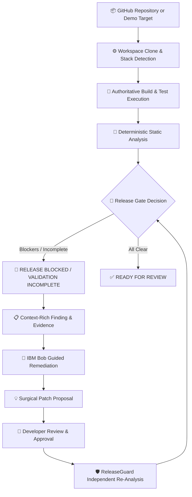
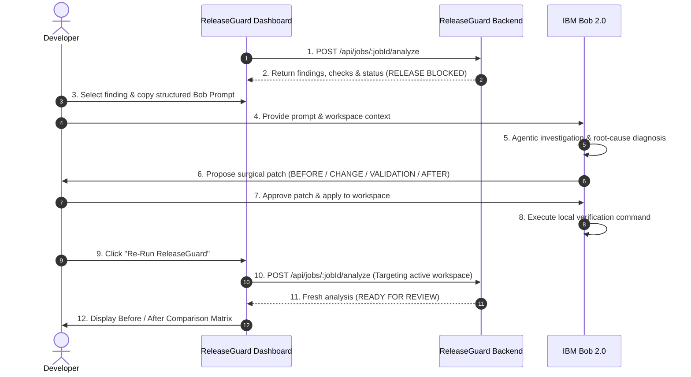

<div align="center">

# 🛡️ ReleaseGuard

### **Evidence-driven release readiness**

**An automated release readiness engine that walks codebases, validates builds and tests, detects critical release risks, and verifies developer-supervised remediations with IBM Bob.**

<br/>

```text
Analyze  →  Detect  →  Remediate  →  Validate  →  Release
```

<br/>

[](#tech-stack)
[](#tech-stack)
[](#ibm-bob-architecture)
[](#release-decision-model)
[](#testing--verification)

<br/>

</div>

---

## ⚡ Key Highlights

<table>
<tr>
<td width="25%" align="center">
<h3>🔍 Evidence</h3>
<p>Deterministic findings anchored to exact file paths, line numbers, and verifiable code evidence.</p>
</td>
<td width="25%" align="center">
<h3>🤖 IBM Bob</h3>
<p>Developer-supervised agentic investigation, root-cause diagnosis, and surgical patch generation.</p>
</td>
<td width="25%" align="center">
<h3>🛡️ Independent Validation</h3>
<p>ReleaseGuard re-runs validation and analysis independently to verify that the blocker was actually fixed.</p>
</td>
<td width="25%" align="center">
<h3>🚦 Release Decision</h3>
<p>Clear <code>READY FOR REVIEW</code>, <code>VALIDATION INCOMPLETE</code>, and <code>RELEASE BLOCKED</code> gate decisions.</p>
</td>
</tr>
</table>

---

## 🛑 The Problem

> ### *"Passing CI does not automatically mean a repository is ready to release."*

Continuous integration confirms that code compiles and unit tests pass, but production release blockers routinely slip through:

```
❌ Hardcoded synthetic or staging credentials committed in configuration files
❌ Debug logging enabled by default in root production profiles
❌ Frontend API client URLs hardcoded to local dev ports (port mismatch)
❌ Unlocked dependency ranges causing non-reproducible releases
❌ Missing production deployment and operational runbooks
❌ Unrun or timed-out build/test checks treated as silent passes
```

**ReleaseGuard provides the missing release gate:** combining deterministic static inspection, stack-scoped build/test validation, and human-in-the-loop remediation workflows with IBM Bob.

---

## 🔄 How It Works



---

## 🛠️ Remediation in Action: Before & After IBM Bob

When a blocker is identified, ReleaseGuard packages the exact finding, line citations, and rule explanation into a scoped IBM Bob remediation context. Once the patch is applied, ReleaseGuard independently re-evaluates the repository to verify resolution.

<table>
<tr>
<th width="50%">1. Before Remediation</th>
<th width="50%">2. After IBM Bob Remediation</th>
</tr>
<tr>
<td valign="top">

```yaml
Rule: SEC-HARDCODED-CREDENTIAL
Severity: HIGH
Category: Security
Decision: RELEASE BLOCKED
File: application.properties:4
```

```properties
server.port=8080
spring.application.name=security-blocked-service
logging.level.root=DEBUG
spring.datasource.password=demo-only-not-a-secret
```

🚨 **Outcome:** Release blocked due to committed credential sentinel.
</td>
<td valign="top">

```yaml
Rule: SEC-HARDCODED-CREDENTIAL
Status: RESOLVED
Remaining: SEC-DEBUG-LOGGING (MEDIUM Warning)
Decision: READY FOR REVIEW
Validation: Verified independently by ReleaseGuard
```

```diff
- spring.datasource.password=demo-only-not-a-secret
+ spring.datasource.password=${DB_PASSWORD}
```

✅ **Outcome:** Blocker resolved; remaining non-blocking warning preserved; release gate cleared.
</td>
</tr>
</table>

> [!IMPORTANT]
> **Separation of Concerns:** IBM Bob performs the agentic remediation under developer supervision; **ReleaseGuard independently validates the result** against the live workspace.

---

## 🚀 See the Full Workflow

```text
GitHub Repo ➔ ReleaseGuard Scan ➔ Deterministic Evidence ➔ IBM Bob Remediation ➔ Independent Validation ➔ Verified Release
```

Explore our built-in interactive demo suite to test clean candidates, broken builds, configuration mismatches, and security blockers in seconds.

---

<br/>

## 🔬 Technical Deep Dive

---

### 1. Deterministic Analysis Pipeline

ReleaseGuard executes a bounded, fully repeatable inspection pipeline:

1. **Target Ingestion:** Accepts public GitHub repositories via URL (`https://github.com/owner/repo`) or pre-configured demo repositories.
2. **Job Isolation:** Clones or prepares an isolated workspace under `backend/workspaces/<jobId>`.
3. **Stack & Ecosystem Detection:** Discovers project manifests (`package.json`, `pom.xml`, etc.) and determines applicable build/test commands without cross-ecosystem pollution.
4. **Authoritative Validation:** Runs declared build and test suites locally with strict execution timeouts and redact-bounded log capture.
5. **Deterministic Rule Engine:** Evaluates static rules across 5 core dimensions:
   - **Security:** Credential patterns, synthetic sentinels, debug log levels.
   - **Configuration:** Production profiles, database URLs, DDL auto-update flags.
   - **Integration:** Frontend API base URLs matching backend listening ports.
   - **Documentation:** README instructions, configuration guidance, deployment runbooks.
   - **Dependencies:** Unlocked npm version ranges vs. lockfile pinning.
6. **Heuristic Scoring:** Computes a severity-weighted transparency score (Base 100 with explicit deductions: CRITICAL -30, HIGH -15, MEDIUM -5, LOW -2).
7. **Release Gate Derivation:** Evaluates blocking conditions deterministically.
8. **Optional AI Explanation:** Queries a local LLM service (Ollama) for developer diagnosis without affecting the deterministic gate decision.
9. **Independent Re-analysis:** Re-evaluates updated workspaces on demand and produces a side-by-side Before/After comparison matrix.

---

### 2. Release Decision Model

ReleaseGuard enforces strict, predictable release gating:

| Decision State | Trigger Conditions | Meaning |
| :--- | :--- | :--- |
| **`RELEASE BLOCKED`** | • Any open **`CRITICAL`** finding<br/>• Any open **`HIGH`** finding<br/>• Authoritative **`Build FAIL`**<br/>• Authoritative **`Tests FAIL`** | The candidate violates release safety policy and cannot be deployed. |
| **`VALIDATION INCOMPLETE`** | • Required build or test check timed out<br/>• Tooling unavailable / check **`NOT RUN`**<br/>• Infrastructure interruption during validation | Checks did not complete. ReleaseGuard fails closed—unrun checks are never treated as passes. |
| **`READY FOR REVIEW`** | • Zero open CRITICAL / HIGH findings<br/>• Applicable build checks **`PASS`**<br/>• Applicable test checks **`PASS`**<br/>• All applicable validation completed | Automated gates pass. Candidate is cleared for manual stakeholder review. |

> [!NOTE]
> **Score vs. Gate:** The numerical readiness score (0–100) is informational context. **The deterministic gate decision alone determines release blocking.** A score of 80 with an open `HIGH` finding is strictly `RELEASE BLOCKED`.

---

### 3. Evidence Model

Every finding produced by ReleaseGuard is an immutable, structured evidence record:

```json
{
  "id": "SEC-HARDCODED-CREDENTIAL:a1b2c3d4",
  "ruleId": "SEC-HARDCODED-CREDENTIAL",
  "category": "Security",
  "severity": "HIGH",
  "status": "OPEN",
  "title": "Hardcoded synthetic credential sentinel is present",
  "affectedFile": "application.properties",
  "startLine": 4,
  "endLine": 4,
  "evidence": "spring.datasource.password=demo-only-not-a-secret",
  "explanation": "A credential-like key is assigned a literal rather than an environment reference.",
  "risk": "Committed secrets or sentinels in source code violate release policy and block release gates.",
  "recommendedFix": "Remove the sentinel or replace it with an environment reference.",
  "remediationHint": "Ask IBM Bob to replace the synthetic marker with an environment variable reference.",
  "confidence": 1.0
}
```

---

### 4. IBM Bob Architecture & Remediation Flow

ReleaseGuard integrates IBM Bob into a developer-controlled, human-in-the-loop workflow:



**Architectural Boundary:** ReleaseGuard supplies deterministic evidence and re-evaluates the resulting workspace; IBM Bob acts as the expert remediation agent under explicit developer approval.

---

### 5. 🧾 IBM Bob Session Summaries

> These session summaries are the recorded artifacts of the actual IBM Bob remediation sessions used in the ReleaseGuard workflow. They provide an auditable record of the investigation, remediation, and validation process.

ReleaseGuard pairs with developer-supervised IBM Bob sessions. When a release blocker is investigated, Bob's step-by-step reasoning, root cause analysis, candidate diffs, and local validation outputs can be exported and tracked in the [`bob_sessions/`](bob_sessions/) directory as verifiable audit records.

| IBM Bob Session | Repository / Workspace | ReleaseGuard Finding | Purpose & Remediation Summary | Session Artifact |
| :--- | :--- | :--- | :--- | :--- |
| **Credential Remediation Session** | `security-blocked` | `SEC-HARDCODED-CREDENTIAL` (HIGH) | Investigated committed synthetic sentinel in `application.properties`, externalized password to `${DB_PASSWORD}`, and validated local build/test pass. | [`bob_sessions/README.md`](bob_sessions/README.md) |
| **Workflow Session Template** | `workspace` | Standard Release Findings | Structured schema capturing session ID, prompt, findings inspected, files changed, and validation commands. | [`bob_sessions/template-session.json`](bob_sessions/template-session.json) |

#### Session Record Schema

For each captured IBM Bob session, the recorded audit artifact documents:

- **Session Identifier:** The unique IBM Bob session or conversation ID.
- **Repository / Workspace:** Target repository inspected (e.g., `security-blocked`, `configuration-risk`, or a public GitHub repo).
- **Target Finding:** The exact ReleaseGuard rule ID (`SEC-HARDCODED-CREDENTIAL`, `INT-API-PORT-MISMATCH`, etc.).
- **Bob Investigation:** Root cause analysis and files inspected by Bob.
- **Surgical Diff:** Exact files modified and lines changed under developer supervision.
- **Bob Validation:** Execution commands run by Bob (e.g., `npm test`, `npm run build`) and their results.
- **ReleaseGuard Independent Verification:** Before/after release gate and score delta verified by ReleaseGuard.

> [!NOTE]
> **Privacy & Process Boundary:** ReleaseGuard does not automatically persist IBM Bob chat transcripts or credentials. Session notes are maintained as operator audit records in the repository to document real human-in-the-loop remediation sessions.

---

### 6. Deterministic Engine vs. AI Assistance

| Aspect | Deterministic Engine (ReleaseGuard) | AI Assistance (Local LLM / Ollama) |
| :--- | :--- | :--- |
| **Responsibilities** | Finding detection, line citations, build/test execution, score computation, release gating, remediation validation. | Root-cause interpretation, plain-English finding explanations, remediation planning assistance. |
| **Authority** | **Authoritative & Hard-Gated.** | **Advisory & Explanatory.** |
| **Fault Tolerance** | Strict failure modes (fail closed on errors). | **Non-fatal:** If the LLM times out or is offline, analysis completes with `llmAssessment: UNAVAILABLE` without changing the release decision. |
| **Dependencies** | Pure local Node.js engine, zero external API keys. | Local Ollama instance (optional). |

---

### 7. Isolated Remediation Lifecycle

ReleaseGuard manages remediation candidates through isolated lifecycle states:

```
[ PROPOSED ] ──► [ APPLIED ] ──► [ VALIDATION ] ──► [ VALIDATED ]
       │                │                │
       ▼                ▼                ▼
  [ REJECTED ]   [ PATCH_FAILED ]  [ VALIDATION_FAILED ]
```

- **Candidate Isolation:** Remediation patches are simulated in isolated before/after workspace copies (`<jobId>-before` and `<jobId>-after`), protecting the base repository from unverified mutations.
- **Differential Analysis:** Computes score deltas, resolved finding lists, remaining finding lists, and check status changes between snapshots.

---

### 8. Interactive Demo Repositories

ReleaseGuard includes 6 dedicated demo repositories covering key release states:

| Demo Repository | Category Focus | Injected Conditions | Expected Gate Decision | Score |
| :--- | :--- | :--- | :--- | :---: |
| **`release-ready`** | Baseline Pass | Clean Node.js repository, passing build & test suites, pinned dependencies, complete documentation. | `READY FOR REVIEW` | **100** |
| **`warning-only`** | Documentation & Deps | Missing deployment guide (`DOC-DEPLOYMENT-RELEASE-PROCEDURE-MISSING`) & unlocked ranges (`DEP-UNLOCKED-RANGES`). | `READY FOR REVIEW` | **90** |
| **`configuration-risk`** | Configuration & Integration | Frontend/backend port mismatch (`INT-API-PORT-MISMATCH`, HIGH) & missing production profile (`CFG-MISSING-PRODUCTION-PROFILE`). | `RELEASE BLOCKED` | **75** |
| **`security-blocked`** | Security | Synthetic credential sentinel (`SEC-HARDCODED-CREDENTIAL`, HIGH) & root DEBUG logging (`SEC-DEBUG-LOGGING`, MEDIUM). | `RELEASE BLOCKED` | **80** |
| **`test-failing`** | Validation | Synthetic deterministic test failure (`test/server.test.js` exits non-zero). | `RELEASE BLOCKED` | **100** |
| **`critically-blocked`** | Compound Blockers | Compound security sentinel, port mismatch, missing production profile, and validation failure. | `RELEASE BLOCKED` | **50** |
| **`ShopSphere`** | Legacy Multi-Service | Original multi-service React + Spring Boot benchmark target. | `RELEASE BLOCKED` | **50** |

---

### 9. Public GitHub Repository Support

ReleaseGuard analyzes public GitHub repositories using the same unified pipeline:

1. Validate and normalize the repository URL: `https://github.com/owner/repository`.
2. Securely clone the repository into an isolated workspace directory.
3. Automatically detect project ecosystems (Node.js, Maven, Spring Boot, etc.).
4. Run stack-scoped validation commands and static security/configuration checks.
5. Re-analyze that exact workspace on demand during iterative remediations.

---

### 10. System Architecture

```
┌────────────────────────────────────────────────────────────────────────┐
│                        React 18 + Vite Frontend                        │
│   Dashboard  ·  Repository Gateway  ·  Evidence Viewer  ·  IBM Bob UI  │
└───────────────────────────────────┬────────────────────────────────────┘
                                    │ HTTP / REST
┌───────────────────────────────────▼────────────────────────────────────┐
│                       Express 4 Backend API (:8090)                    │
│                                                                        │
│   ┌─────────────────────┐  ┌─────────────────────┐  ┌──────────────┐   │
│   │ Job & Workspace Mgr │  │  Stack Detector     │  │ allowlist    │   │
│   │ /workspaces/<jobId> │  │  Node / Maven / etc │  │ commandRunner│   │
│   └──────────┬──────────┘  └──────────┬──────────┘  └──────┬───────┘   │
│              │                        │                    │           │
│   ┌──────────▼────────────────────────▼────────────────────▼───────┐   │
│   │               Deterministic Repository Analyzer                │   │
│   │   Security  ·  Configuration  ·  Integration  ·  Docs  ·  Deps │   │
│   └───────────────────────────────┬────────────────────────────────┘   │
│                                   │                                    │
│   ┌───────────────────────────────┴────────────────────────────────┐   │
│   │      Optional LLM Assessment Service (:8091) / Ollama          │   │
│   │      Non-fatal Explanation & Root-Cause Interpretation         │   │
│   └────────────────────────────────────────────────────────────────┘   │
└────────────────────────────────────────────────────────────────────────┘
```

---

### 10. System Architecture

```
┌────────────────────────────────────────────────────────────────────────┐
│                        React 18 + Vite Frontend                        │
│   Dashboard  ·  Repository Gateway  ·  Evidence Viewer  ·  IBM Bob UI  │
└───────────────────────────────────┬────────────────────────────────────┘
                                    │ HTTP / REST
┌───────────────────────────────────▼────────────────────────────────────┐
│                       Express 4 Backend API (:8090)                    │
│                                                                        │
│   ┌─────────────────────┐  ┌─────────────────────┐  ┌──────────────┐   │
│   │ Job & Workspace Mgr │  │  Stack Detector     │  │ allowlist    │   │
│   │ /workspaces/<jobId> │  │  Node / Maven / etc │  │ commandRunner│   │
│   └──────────┬──────────┘  └──────────┬──────────┘  └──────┬───────┘   │
│              │                        │                    │           │
│   ┌──────────▼────────────────────────▼────────────────────▼───────┐   │
│   │               Deterministic Repository Analyzer                │   │
│   │   Security  ·  Configuration  ·  Integration  ·  Docs  ·  Deps │   │
│   └───────────────────────────────┬────────────────────────────────┘   │
│                                   │                                    │
│   ┌───────────────────────────────┴────────────────────────────────┐   │
│   │      Optional LLM Assessment Service (:8091) / Ollama          │   │
│   │      Non-fatal Explanation & Root-Cause Interpretation         │   │
│   └────────────────────────────────────────────────────────────────┘   │
└────────────────────────────────────────────────────────────────────────┘
```

---

### 11. Tech Stack

| Layer | Technologies |
| :--- | :--- |
| **Frontend** | React 18, Vite, Tailwind CSS, Lucide-style SVG icons, Native Fetch |
| **Backend API** | Node.js (ES Modules), Express 4, CORS, Node Native Crypto & FS |
| **Analysis Engine** | Deterministic Regex & AST Pattern Matchers, XML/JSON Manifest Parsers, Allowlisted Subprocess Execution |
| **AI / LLM** | Optional Node.js LLM proxy connecting to local Ollama (`granite3-dense:8b` / `llama3.2`) |
| **Testing** | Node.js Built-in Test Runner (`node --test`), Assert/Strict, Playwright E2E |

---

### 12. Running Locally

#### Prerequisites
- **Node.js**: v18.0.0 or higher
- **npm**: v9.0.0 or higher

#### Quickstart (2 Terminals)

```bash
# Terminal 1: Start Backend API (port 8090)
cd backend
npm install
npm run dev

# Terminal 2: Start Frontend Dashboard (port 5173)
cd frontend
npm install
npm run dev
```

Open **http://localhost:5173** in your browser.

#### Optional: LLM Assessment Service (Terminal 3)
```bash
cd llm-service
npm install
npm run dev
```
*(Requires a running local Ollama instance on port 11434).*

---

### 13. Testing & Verification

Run the test suites across backend and frontend:

```bash
# Run backend test suite (39 unit & integration tests)
cd backend
npm test

# Run frontend test suite (19 unit tests)
cd frontend
npm test

# Verify production frontend build
cd frontend
npm run build
```

---

### 14. Core Engineering Principles

1. **Evidence Before Explanation:** Line citations, files, and outputs are gathered before generating AI summaries.
2. **Human-in-the-Loop Remediation:** AI proposes surgical diffs; developers explicitly approve mutations.
3. **Surgical, Minimal Changes:** Remediations fix the single target finding without performing unbounded rewrites.
4. **Independent Validation:** ReleaseGuard never relies on AI self-reporting; the modified workspace is tested independently.
5. **Protected Original Workspace:** Candidate patches are executed in sandbox workspaces before baseline adoption.
6. **Deterministic Release Gate:** Gating decisions follow strict boolean logic, unaffected by LLM timeouts or outages.

---

<div align="center">

# ReleaseGuard

### **Analyze it. Remediate it. Validate it. Release with evidence.**

Built for the **IBM Bob 2.0 Hackathon**.

</div>
